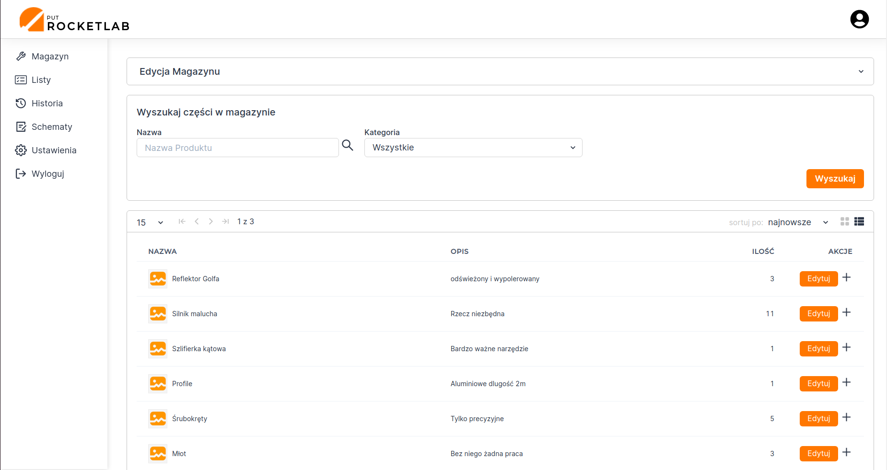
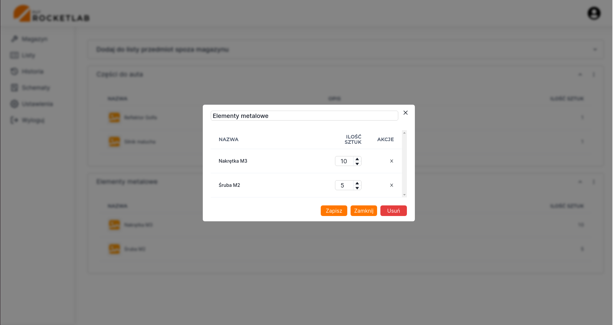

# It's not a rocket science

## About project
Our app was created as a tool for Academic Circle at Poznan University of Technology. It is aimed to enhance
workflow in terms of storing and managing stored items. Main features include storage management, shopping list 
management, events history(e.g. items removals) and assembly schemes.

## Tools
- React.js
- ChakraUI
- Next.js
- MongoDB
- Auth0
- Redux
- Lodash

## Modules
### Storage
Section dedicated to store and edit items. Here we are capable of grouping items with categories and adding them to 
shopping lists.




### Lists
Section dedicated to keeping shopping lists in case of lack in supplies. Here we are able to modify lists or add to
list items that are not currently in our storage.




### Schemes
Section dedicated to keeping schemas with elements that are needed for building for instance an engine of a rocket.


### History
```IN PROGRESS```

## Environment variables

For the app to run correctly, specify proper environment variables you must. 
```dotenv
# mogodb credentials
MONGODB_URI=<You mongodb connection string>

# Auth0 credentials
AUTH0_SECRET=<You Auth0 secret>
AUTH0_BASE_URL=<You Auth0 base url>
AUTH0_ISSUER_BASE_URL=<You Auth0 issuer base url>
AUTH0_CLIENT_ID=<You Auth0 client id>
AUTH0_CLIENT_SECRET=<You Auth0 client secret>
```

## Getting Started

First, run the development server:

```bash
npm run dev
# or
yarn dev
```

Open [http://localhost:3000](http://localhost:3000) with your browser to see the result.
